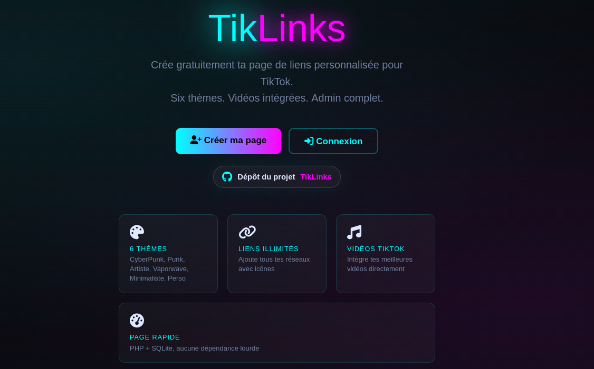
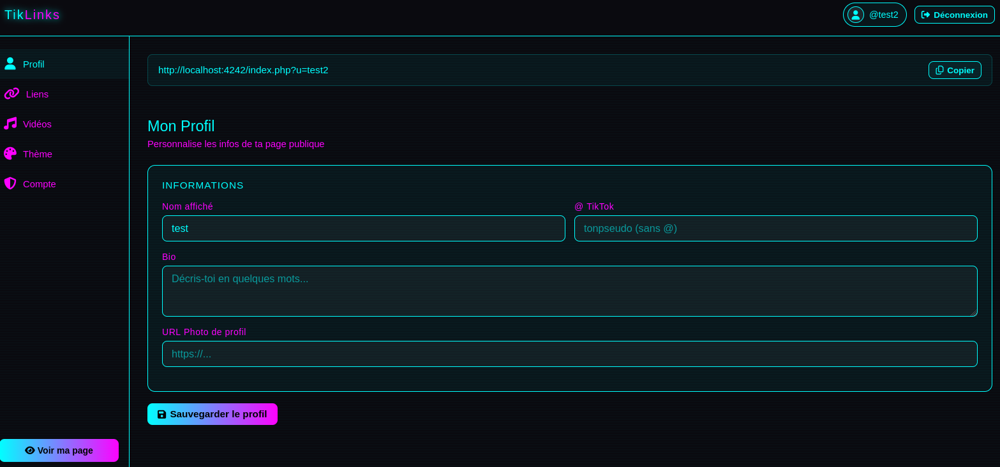
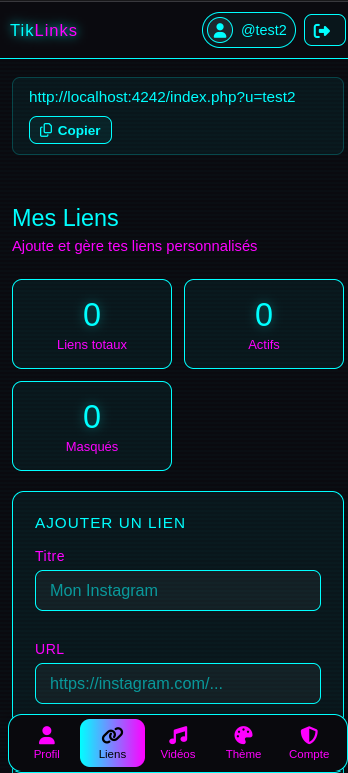

<p align="center">
  
</p>


>Linktree optimisé TikTok — PHP natif, SQLite, zéro dépendance.

<p align="center">
  
  
  
  
  
  
  
</p>


## Aperçu

### Page d'accueil



### Admin desktop



### Admin mobile



## Features

- **Auth complète** : inscription/connexion avec `password_hash()`
- **Profil personnalisable** : bio, avatar, handle TikTok, nom affiché, photo admin séparée
- **Liens illimités** : titre, URL, icône Font Awesome, ordre, activation/désactivation
- **Vidéos TikTok** : miniatures via oEmbed et lien direct sans bloc noir
- **6 thèmes visuels** : CyberPunk, Punk, Artiste, Vaporwave, Minimaliste, Perso
- **Admin dashboard** : gestion en temps réel, stats, preview live
- **Responsive** : navigation mobile fixe en bas, animations CSS, effets cyberpunk
- **Sécurité compte** : changement de mot de passe et double authentification TOTP avec QR code
- **Lightweight** : PHP 8+ SQLite WAL, pas de cURL, pas de composer

## Requirements

```bash
PHP >= 8.0
SQLite3 (activé par défaut)
Serveur web (Apache/Nginx) ou `php -S localhost:4242`
```

Ou avec Docker :

```bash
Docker
Docker Compose
```

## Installation

```bash
# 1. Cloner ou déposer index.php dans votre dossier web
# 2. Définir l'URL canonique du site
# 3. Assurer les droits d'écriture sur le dossier de données hors webroot
# 4. Accéder à http://votre-domaine/index.php

# Dev local rapide :
TIKLINKS_SITE_URL=http://localhost:4242/index.php php -S localhost:4242 index.php
```

> La BDD `linkdata.sqlite` se crée automatiquement au premier accès dans `../tiklinks-data/` par défaut, hors du dossier web.

## Démarrage avec Docker

Depuis l'image Docker Hub :

```bash
docker run -d \
  --name tiklinks \
  -p 4242:4242 \
  -e TIKLINKS_SITE_URL=http://localhost:4242/index.php \
  -e TIKLINKS_DATA_DIR=/data \
  -v tiklinks-data:/data \
  liberchat/tiklinks:latest
```

Avec Docker Compose :

```bash
docker compose up -d
```

Puis ouvrir :

```text
https://votre-site/index.php
```

Admin :

```text
https://votre-site/index.php?action=admin
```

Les données SQLite sont conservées dans le volume Docker `tiklinks-data`.

Pour changer l'URL publique :

```bash
TIKLINKS_SITE_URL=https://votre-domaine.com/index.php docker compose up -d
```

Sur un réseau local, garde bien le protocole `http://`. En production derrière ton domaine, utilise l'URL publique :

```bash
TIKLINKS_SITE_URL=https://votre-site/index.php docker compose up -d
```

## Image Docker Hub

```bash
docker pull liberchat/tiklinks:latest
docker buildx build --platform linux/amd64,linux/arm64 -t liberchat/tiklinks:latest --push .
```

L'image `liberchat/tiklinks:latest` est publiée pour `linux/amd64` et `linux/arm64`.

## Usage

### Page publique
```
https://votre-site/index.php?u=pseudo
```

### Admin
```
https://votre-site/index.php?action=admin
```

### Flux principal
| Route | Description |
|-------|-------------|
| `/` | Landing page |
| `?action=register` | Inscription |
| `?action=login` | Connexion |
| `?action=admin` | Dashboard (auth requis) |
| `?u={username}` | Page publique utilisateur |

## Structure

```
index.php                  # Application mono-fichier (MVC inline)
../tiklinks-data/          # Données SQLite hors webroot par défaut
../tiklinks-data/linkdata.sqlite
```

## Thèmes disponibles

```php
'cyberpunk'   // Neon cyan/magenta, scanlines
'punk'        // Rouge agressif, noise
'artiste'     // Or/ambre, grain
'vaporwave'   // Rose/violet, grid retro
'minimaliste' // Noir/blanc épuré
'custom'      // Template Perso : couleurs et image de fond
```

## Configuration avancée

```bash
# URL publique canonique utilisée pour les redirections et liens
export TIKLINKS_SITE_URL=https://votre-domaine.com/index.php

# Dossier ou fichier SQLite personnalisés
export TIKLINKS_DATA_DIR=/var/lib/tiklinks
export TIKLINKS_DB_PATH=/var/lib/tiklinks/linkdata.sqlite
```

## Sécurité

- Mots de passe hashés via `PASSWORD_DEFAULT` (bcrypt/argon2id)
- Requêtes préparées PDO (injection SQL protégée)
- Échappement HTML avec `htmlspecialchars(..., ENT_QUOTES)`
- Protection CSRF sur les formulaires POST
- Sessions avec cookies `HttpOnly`, `SameSite=Lax`, et régénération d'ID après connexion
- Validation des schémas d'URL des liens publics
- Double authentification TOTP avec QR code
- BDD SQLite hors webroot par défaut

## Vidéos TikTok

Format accepté :
```
https://www.tiktok.com/@pseudo/video/1234567890
```

TikLinks récupère la miniature via oEmbed et ouvre la vidéo sur TikTok au clic.

## Dev & Contrib

```bash
# Lancer avec Docker
docker compose up -d

# Build + push Docker Hub
docker buildx build --platform linux/amd64,linux/arm64 -t liberchat/tiklinks:latest --push .

# Lancer en local
TIKLINKS_SITE_URL=http://localhost:4242/index.php php -S localhost:4242 index.php

# Tester la création BDD
curl http://localhost:4242/index.php?action=register

# Vérifier les logs SQLite
sqlite3 ../tiklinks-data/linkdata.sqlite ".tables"
```

## License

MIT.

---

> Astuce : Ajoute `?u=tonpseudo` à ton bio TikTok pour rediriger vers ta page TikLinks !

```
┌─────────────────────────────┐
│  TikLinks v1.0              │
│  PHP 8+ • SQLite • Zero Dep │
│  Deploy in 60 seconds      │
└─────────────────────────────┘
```
